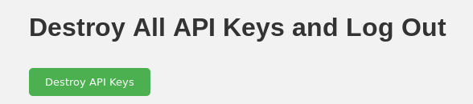

# Introduction

This is a [social reader](https://indieweb.org/reader) style blog feed reader. It is a web application designed to be self-hosted on an individual basis, with one user per instance. It can be installed via Docker or manually. It is on DockerHub as [tjones10/microformats-email-reader](https://hub.docker.com/repository/docker/tjones10/microformats-email-reader/general)

It relies on the [microformats](https://indieweb.org/microformats) standard, which is an extension of RSS and HTML. This standard allows better information extraction from blogs that the reader is subscribed to. This allows easy extraction of the full article content, and presentation of the content in a way that closely resembles the feed of a social media application, or conversion of the content into other formats such as email. Microformats are a key part of the [Indieweb project's](https://indieweb.org/) standards. Combined with other Indieweb applications and standards, this tool can be used to make traditional blogs function like what is expected from social media applications -- in effect creating a form of decentralized social media. 

Notable additional features include 
* A way to assign a priority or probability to a feed. If this is set, the script will randomize if it sends a post to the user. The chance that the post will be sent is set by the user. This functionality exists to avoid an information overload effect. It in effect allows partial subscriptions to a feed -- you will get some of the feeds of the person you are subscribed to 

This application has two ways of presenting the blog posts it is subscribed to
* Sending emails containing the content of the blog posts 
* Viewing all downloaded posts in an infinite scroll view

Major differences of note compared to traditional RSS feed readers and some social readers include
* It can handle short posts, and posts without a title elegantly. A lot of RSS feed readers handle this type of content very poorly, expecting only long form content. I do not know of a self-hosted web based traditional feed reader which has a way of handling this type of content that I would consider elegant.
* It will read the URL of the content in the feed, download that URL and parse it to get the full content of the post -- this functionality is dependent on Microformats. 
* It has a very monolithic structure compared to other social readers, this application contains both code that subscribes to and downloads feeds, and code that displays the content. This approach improves the ease of which this application can be installed on a web server by a novice. The more common structure within the Indieweb project is to split these two functionalities. Ie. one application that manages subscriptions, and another which views the data that the first application collected. However, in this application there is still a robust API which allows full access to the data stored by this application, and enables integrating it other applications. Additionally, a planned future feature is to support standard protocols for allowing external applications to view the downloaded feeds, this includes [Microsub](https://indieweb.org/Microsub)
* The current way of authentication is an email magic link. Indieauth support is planned, but not yet implemented. 

This application works and all of the functionality mentioned in the documentation that follows is confirmed to be functional. However, this application is still in an early stage of development, and some core social features are not yet implemented, such as an elegant way to reshare posts, and a way of managing "likes". 

For my current use case it has reached the point where it is useful for my use cases, which is why I am sharing it now. Additional features will be added in the future. 

This application does not currently support downloading feeds from websites which do not have content structured as microformats. A planned feature is to provide support for blogging engines such as Wordpress which have predictable content structures (even if not microformats) In the future, I will experiment with how to implement downloading generic RSS feeds. 

I have built a Docker container to simplify the installation of this application. 

# Usage Documentation


## Main Menu

The main menu is at the top of every page and includes links to `Manage Feeds`, Change `Settings`, view a `Scrolling Feed` of all posts, and `Logout` of the application. 

## Home Page/Feed Management 

On the homepage of the application, you can add, remove and modify feeds. 

### Adding an RSS Feed Based on Exact URL


This feature is for cases when you know the exact path to the RSS xml for the website you are adding. 

The first field (named "Human Readable Name Of the Feed") is a user generated short hand for quick reference in the future. It is also the sender name for when an email notifying about a new feed is sent.

The second field of the form ("URL of the Feed") is the exact url of the RSS feed you are importing including both the domain name and the path to the RSS feed. The protocol (http or https) must be included ie. `https://example.com/.rss`

A `/` at the end must not be included.

The numerical field is the probability that each post will be downloaded. It must be between `1` and `0`. If set to `1`, the posts will always be downloaded for that feed. If set to `0` the posts will never be downloaded. Decimal probabilities cause the application to download items some of the time. Ie. if set to `0.25` it will download on average 25% of the posts of that particular feed.

### Adding an RSS Feed based on Homepage URL

This feature is for cases when you know the path to the home page of the website you want to add. Based on metadata in that web page, it is able to figure out the path to the RSS feed. 

The first field (named "Human Readable Name Of the Feed") is a user generated short hand for quick reference in the future. It is also the sender name for when an email notifying about a new feed is sent.

The second field of the form ("URL of the Feed") is the exact url of the website you want to add to the reader you are importing. The protocol (http or https) must be included ie. `https://example.com`

A `/` at the end must not be included.

The numerical field is the probability that each post will be downloaded. It must be between `1` and `0`. If set to `1`, the posts will always be downloaded for that feed. If set to `0` the posts will never be downloaded. Decimal probabilities cause the application to download items some of the time. Ie. if set to `0.25` it will download on average 25% of the posts of that particular feed.

### Starting an Immediate Download of Feed Content 


Clicking the "Refresh All Feeds and Send Emails" button will cause the feed reader application to download all posts from its feeds, store the new posts in its database, and send notifications for the new posts. Note that all feeds will be downloaded automatically every 15 minutes. 

### Deleting all Stored Posts


Clicking the "Delete All Stored Articles" button will delete every article that is stored in the database. It will not remove any of the feeds, but previously downloaded posts in those feeds will not be redownloaded, even if they were deleted from the database. 

This will clear the infinite scroll.

### Managing Currently Added Feeds / List of Feeds


The "List of feeds" view can be used to view what feeds are currently being read by the reader.

#### Deleting a Feed


Clicking the "Remove" button removes the feed, and its post will no longer be downloaded. Previously downloaded posts will not be removed from the database, but no new posts will be downloaded.

#### Download the Feed Now 

Clicking the "Download Now" button will cause the feed reader application to download all posts from this feed (not not any other feeds), store the new posts in its database, and send notifications for the new posts. Note that all feeds will be downloaded automatically every 15 minutes. 

#### Update the Probability


To update the probability that a each given post will be downloaded click on the "Update Probability" button. 

The following pop up will appear 


Enter the new sending probability, and click `OK`. It must be between `1` and `0`. If set to `1`, the posts will always be downloaded for that feed. If set to `0` the posts will never be downloaded. Decimal probabilities cause the application to download items some of the time. Ie. if set to `0.25` it will download on average 25% of the posts of that particular feed.

## Settings

### SMTP Settings 


This form sets the SMTP host, port, username, and password. This is set up on first run of the application, but can be changed here. These values need to be correct inorder for emails to send.

Click "Save SMTP Settings" to save any changes you have made. 

### Destroy All API Keys and Browser Sessions



This will delete all API keys from the database. It will also delete tokens used to authenticate browser sessions from the database. The latter will cause all browser to be logged out immediately.

### Generate an API Key 


This will generate an API key and a corresponding User ID. After the button is clicked and the API key is generated, the view will look like the following  


## Scrolling Feed 


The scrolling feed is a feed of all downloaded blog posts. The link to the original article is the link at the end of every post named `View Original Post`

# Other Notes 
* The feeds will be checked for new content every 15 minutes. 

# Installation

The current best way to install this application is through Docker. This software has been uploaded to DockerHub

The following is a `docker-compose` file which does this install. Change the environment variables to suit your configuration. 

```

version: '3'

services:
  microformatsfeedreader:
    image: tjones10/microformats-email-reader:latest
    command: python main.py
    ports:
      - "5000:5000"
    volumes:
      - /pathtofolder:/usr/src/app/db/
    environment:
      - EMAIL=username@example.com
      - SMTP_HOST=example.com
      - SMTP_PORT=587
      - SMTP_USER=username@example.com
      - SMTP_PASSWORD=very_strong_password
      - DOMAIN=example.com
    restart: unless-stopped
```

# API 

1. `/api/send_magic_link`: Accepts POST requests. It sends a magic link for authentication to the provided email address if it's in the database.

2. `/api/authenticate`: Accepts GET requests. It authenticates the user and provides them with an API key.

3. `/api/hello`: Accepts GET requests. Returns a 'Hello World' message.

4. `/api/emails`: Accepts GET requests. Returns a list of all emails in the collection.

5. `/api/add_email` and `/api/remove_email`: Accept POST requests. Adds and removes an email from the collection respectively.

6. `/api/feeds`: Accepts GET requests. Returns a list of all feeds in the collection.

7. `/api/add_feed` and `/api/remove_feed`: Accept POST requests. Adds and removes a feed from the collection respectively.

8. `/api/get_api_key` and `/api/destroy_all_api_key`: Accept GET requests. The former gets an API key while the latter destroys all API keys and creates a new one.

9. `/api/is_any_email_in_db`: Accepts GET requests. Checks if any email is in the collection.

10. `/api/get_rss_feed_url`: Accepts POST requests. Retrieves an RSS feed URL from a homepage URL.

11. `/api/download_articles_in_rss_feed`: Accepts POST requests. Downloads articles in an RSS feed.

12. `/api/get_current_time`: Accepts GET requests. Returns the current server time.

13. `/api/list_feeds_with_last_updated`: Accepts GET requests. Lists feeds with the last updated timestamp.

14. `/api/get_feed_last_updated` and `/api/change_feed_last_updated`: Accept POST requests. The former gets the last updated timestamp of a feed, and the latter changes the last updated timestamp of a feed.

15. `/api/download_articles_in_feed_and_update_last_updated`: Accepts POST requests. Downloads articles in a feed and updates the last updated timestamp of the feed.

16. `/api/set_needed_smtp_vars_into_db`: Accepts POST requests. Sets needed SMTP variables in the database.

17. `/api/is_smtp_data_set`: Accepts GET requests. Checks if SMTP data has been set.

18. `/api/send_test_email`: Accepts POST requests. Sends a test email.

19. `/api/send_email_about_new_articles_in_feed` and `/api/send_email_about_new_articles_in_all_feeds`: Accept POST requests. The former sends an email about new articles in a specific feed, and the latter sends an email about new articles in all feeds.

20. `/api/get_smtp_data`: Accepts GET requests. Retrieves SMTP data.

21. `/api/has_valid_api_key`: Accepts GET requests. Checks if the client has a valid API key.

22. `/api/destroy_current_api_key` and `/api/create_new_api_key`: Accept GET requests. The former destroys the current API key, and the latter creates a new API key.

23. `/article_raw_html`: Accepts GET requests. Returns the raw HTML of an article.

24. `/api/destroy_all_articles_in_db`: Accepts GET requests. Destroys all articles in the database.

25. `/api/update_feed_probability`: Accepts POST requests. Updates the probability of a feed.

26. `/api/get_posts_bt_start_and_limit`: Accepts GET requests. Retrieves a number of posts starting from a specified index.

Most routes are protected by a decorator `@require_api_key`, which ensures that the client must provide a valid API key in their request to access these routes. If a valid API key isn't provided then the request will fail.

# Todo 
* Complete frontend documentation
* API Documentation improvements 
* More social aspects
* * Likes page
* * Bookmarks
* * Webmention sender for the above 
* Create install script for FreeBSD
* Improved installation documentation
* Allow disabling email sending
* Improve Mobile Responsiveness
* Expire API keys generated by browser login after a set time, and after a major change in location
* Data validation when adding feeds to make sure users are not sending broken URLs
* Improvements to API to allow more access to stored data, and to allow improved integrations
* Refactor code
* Automatically refresh RSS feed urls when the main domain name is known
* Making url parcing of user input more robust, and handle different url variants when adding a feed
* Improve features to assign a distance/probability to feeds
* Improve HTML cleaning
* Improvements to email layout
* Add support for non-microfeed blogging engines with predictable data structures.
* Improve cacheing of RSS feeds.
* Treat microformats types such as Likes differently (ie. push out only with a low probability)
* IndieAuth login method
* GUI initial setup (has to be designed carefully to avoid security issues)
* Scrolling feed/more traditional social view. 
* Microsub endpoint 
* Clean up UI 